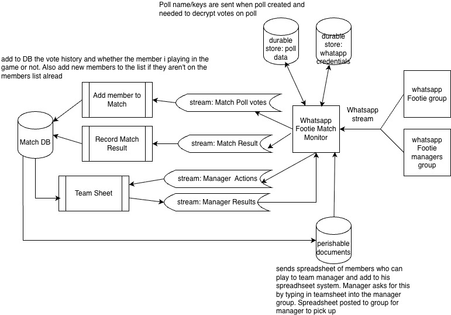

# WhatsApp Group Reader POC

Proof of concept around Whatsapp to: 
1. check if it's possible to read WhatsApp group messages
and recreate the contents of the polls by storing them in a database.
2. Check what happens when the code starts after a group is created. Can it read it?
3. Can we read instructions from another group (eg. generate teamsheet) using data collected
4. Can Claude code do most of the work to save effort?

## Background

In our grassroots football club (PolyTechnic FC), most of the 10 teams in the club use WhatsApp to manage teams, report scores on matchday, etc.
Can I automate the processes that the captains do manually through whatsapp? This means reading 
Teams whatapps groups/captains instructions and updating captains what they need  
by updating channels with message/files containing data they need. Ultimately, I want
to integrate with the FA App so that things like teamsheets can be generated automated on match days, 
the club's website can be updated with the latest results on match days, etc.

It will save a lot of time and free them up to play football (which is the point of being in the club).

## POC architecture



## What it does

The **Whatsapp-message-Monitor** service connects to WhatsApp via [Baileys](https://github.com/WhiskeySockets/Baileys), watches a named group, and routes messages to Kafka:

| Message                                       | Kafka topic | Stored in        |
| --------------------------------------------- | ----------- | ---------------- |
| Text starting with `score` (case-insensitive) | `score`     | `messages` table |
| Poll created                                  | `poll`      | `polls` table    |
| Poll vote                                     | `poll`      | `poll_votes` table |

All events are also persisted in PostgreSQL.

---

## Prerequisites

- Node.js 20+
- A running Kafka broker + Zookeeper
- A running PostgreSQL instance
- A WhatsApp account that is a member of the group you want to monitor

---

## Running locally

### 1. Install dependencies

```bash
npm install
```

### 2. Configure environment

```bash
cp .env.example .env
```

Edit `.env` and set at minimum:

```
WHATSAPP_GROUP_NAME=My Football Group   # exact name of the WhatsApp group
POSTGRES_PASSWORD=changeme
```

### 3. Start the service

```bash
npm start
```

On first run a QR code is printed in the terminal. Scan it with WhatsApp
(**Linked Devices > Link a Device**). The credentials are saved to `./auth_info`
and reused on subsequent starts — no re-scan needed unless you log out.

### 4. Development mode (auto-restart on file changes)

```bash
npm run dev
```

---

## Running on Kubernetes (local cluster through helm with Orbstack)

assumes that you have orbstack up and runnong on your mac.

### 1. Build the Docker image

```bash
docker build -t whatsapp-monitor:latest .
```

### 2. Deploy with Helm

```bash
helm install footie ./helm/whatsapp-monitor \
  --set monitor.config.groupName="test-group" \
  --set postgres.password="strong-password"
```

To override any value without editing `values.yaml`, use `--set key=value`.
See `helm/whatsapp-monitor/values.yaml` for all available options.

### 3. Pair WhatsApp (first time only)

The monitor pod prints a QR code in its logs on first start:

```bash
kubectl logs -f deployment/footie-monitor
```

Scan the QR code with WhatsApp (**Linked Devices > Link a Device**).
The session is persisted in the `credentials` PersistentVolumeClaim so it
survives pod restarts.

### 4. Access PostgreSQL from your machine

The Postgres service is exposed as a NodePort on **30432**:

```bash
# minikube
psql -h $(minikube ip) -p 30432 -U whatsapp -d whatsapp_monitor

# kind / docker desktop — localhost works directly
psql -h localhost -p 30432 -U whatsapp -d whatsapp_monitor
```

### 5. Upgrade / uninstall

```bash
# apply config changes
helm upgrade footie ./helm/whatsapp-monitor --reuse-values \
  --set monitor.config.groupName="New Group Name"

# tear everything down (PVCs are kept by default)
helm uninstall footie
```

---

## Environment variables

| Variable               | Default             | Description                                    |
| ---------------------- | ------------------- | ---------------------------------------------- |
| `WHATSAPP_GROUP_NAME`  | `My Football Group` | Exact name of the group to monitor             |
| `AUTH_DIR`             | `./auth_info`       | Directory where session credentials are stored |
| `KAFKA_BROKERS`        | `localhost:9092`    | Comma-separated list of Kafka brokers          |
| `KAFKA_SCORE_TOPIC`    | `score`             | Topic for score messages                       |
| `KAFKA_POLL_TOPIC`     | `poll`              | Topic for poll events                          |
| `POSTGRES_HOST`        | `localhost`         | PostgreSQL host                                |
| `POSTGRES_PORT`        | `5432`              | PostgreSQL port                                |
| `POSTGRES_DB`          | `whatsapp_monitor`  | Database name                                  |
| `POSTGRES_USER`        | `postgres`          | Database user                                  |
| `POSTGRES_PASSWORD`    | `postgres`          | Database password                              |

---

